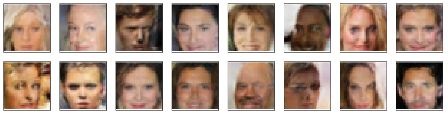

# generate-faces
The 'Generate Faces' project as part of Udaciy's Deep Learning Nanodegree.
# Goal
Define and train a DCGAN on a dataset of faces, to get a generator network to generate new images of faces that look as realistic as possible!
# Dataset
For this project I used images form the [CelebA](https://www.kaggle.com/jessicali9530/celeba-dataset), here is a sample:

# Results
I trained a DCGAN that was capable of generating faces here are some samples:

